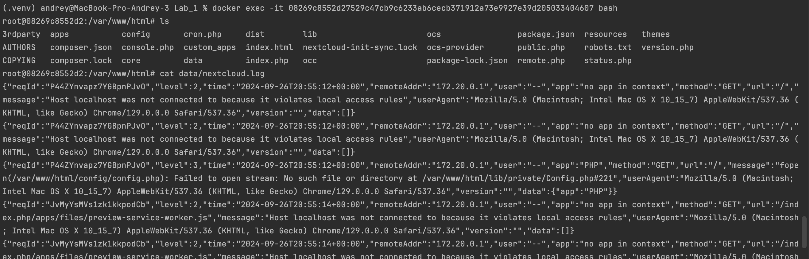
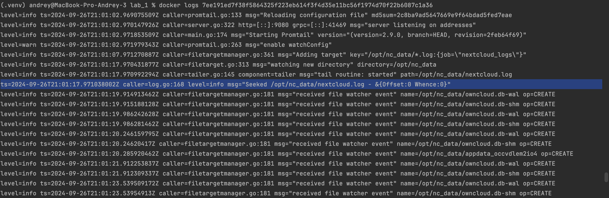
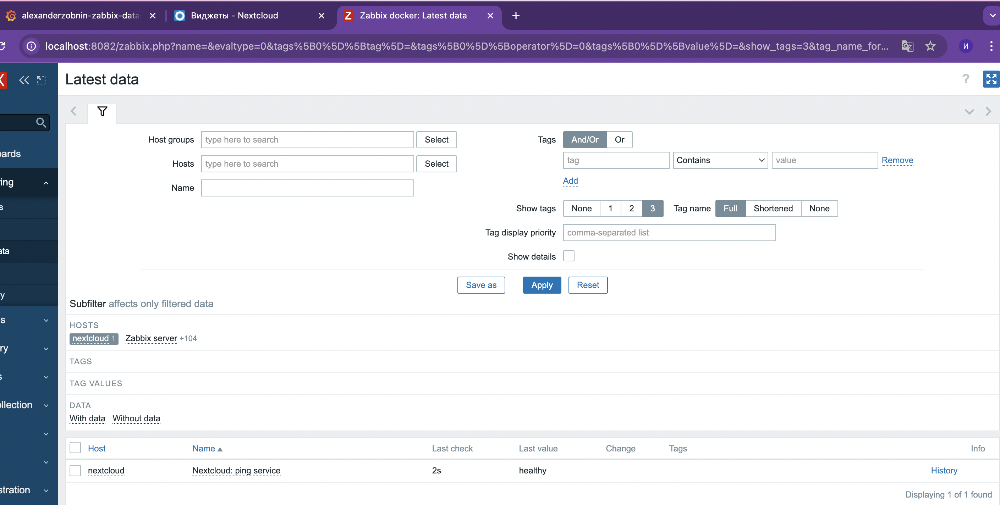
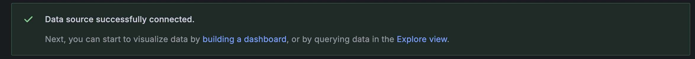
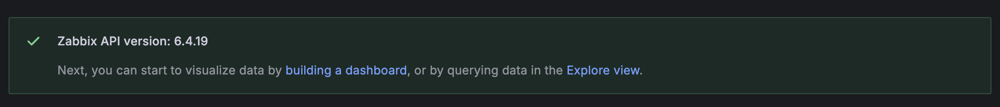
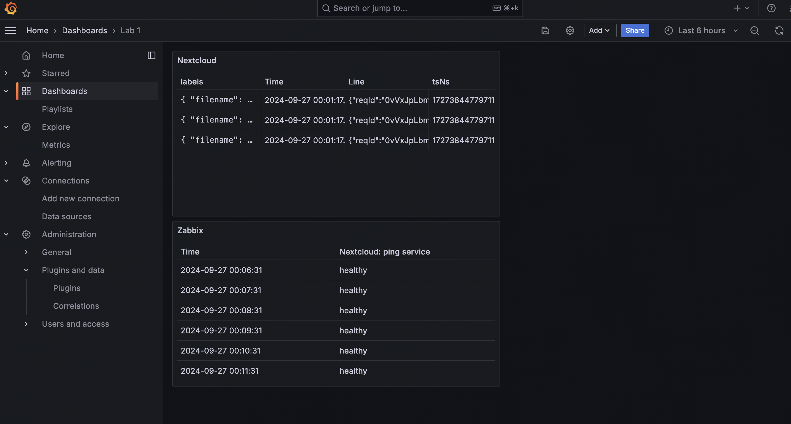

# Лабораторная работа №1

### Выполнение:

1. После создания учетной записи в nextcloud, проверил nextcloud.log

2. Проверил promtail подсоединился к nextcloud и собирает логи

3. Связал nextcloud и zabbix для получения логов о состоянии nextcloud (health)

4. Добавил в grafana Loki data source

5. Добавил в grafana Zabbix data source (для этого установил соответствующий plugin)

6. Создал два dashboard для логирования zabbix и  nextcloud  

### Ответы на вопросы:

1) Основное различие заключается в том, что SLA является официальным соглашением с клиентом, тогда как SLO — это внутренние цели, которые помогают обеспечить выполнение условий SLA
 
2) Различие в том, что инкрементальный бэкап - сохраняет изменения с последнего бэкапа (полного или инкрементального),
   а дифференциальный бэкап - сохраняет изменения с последнего полного бэкапа.

3) Разница в том, что monitoring - фокусируется на сборе метрик для оценки производительности, а
   observability - охватывает более широкий спектр данных (логи, трассировки) для понимания состояния системы и выявления причин проблем.
