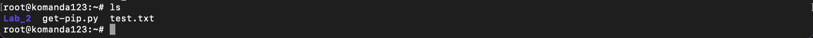
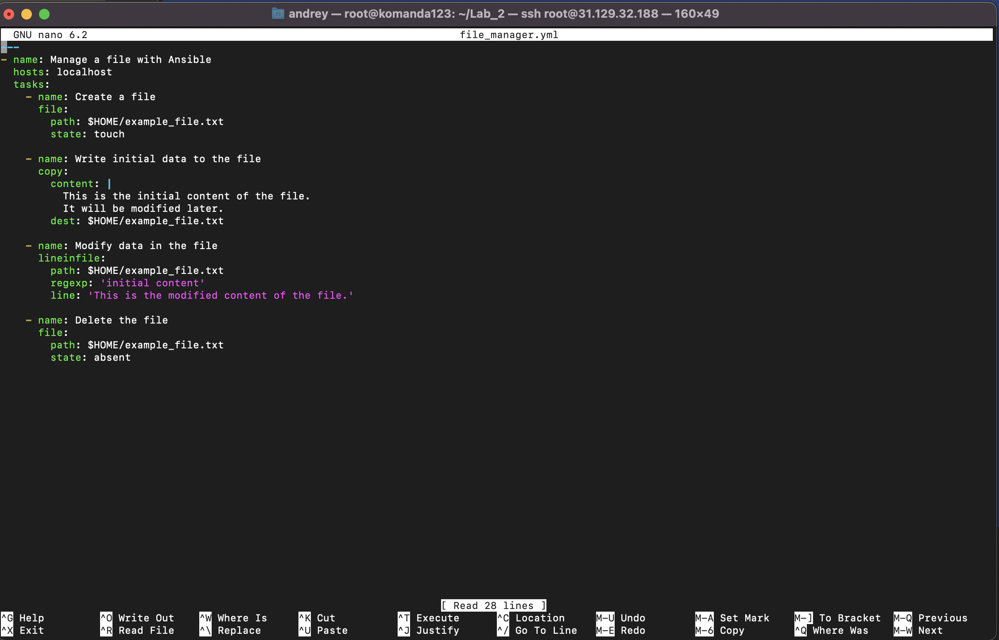

# Лабораторная работа №2

### Выполнение:

1. Проверяю, что сервер с Ansible подключился к “клиенту”

2. Создаю текстовый файл через shell

3. Проверяю, что по нужному пути создался нужный файл с нужным именем и содержимым

4. Удаляю файл через модуль file

5. Инициализация Caddy

6. Запускаю playbook: ansible-playbook caddy_deploy.yml и проверяю, успешно ли все шаги выполнились  

7. Запускаю playbook, ввожу в браузере имя своего домена и убеждаюсь, что тестовая страничка Caddy автоматически поднялась на подписанном сертификате с https

### Задания:

1) Создаю playbook (file_manager.yml) и запускаю его, чтобы:
   1. Создать файл
   2. Записать в него данные
   3. Поменять содержимое
   4. Удалить

   Playbook: 
   Выполнение: 

2) Всю лабораторную работу выполнил на виртуальной машине и создал домен: lab2domen.duckdns.org
