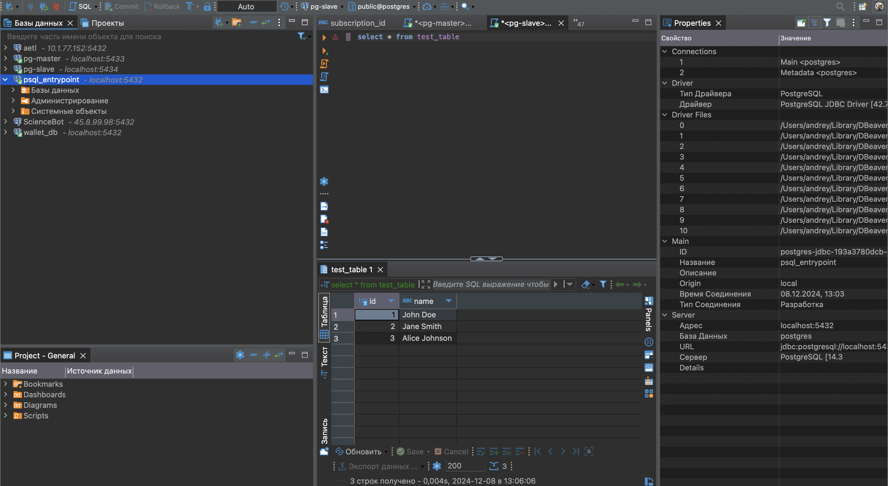

1# Лабораторная работа №2: PostgreSQL Cluster с Patroni, ZooKeeper и HAProxy

### Выполнение:

1. **Проверка работы репликации**  
   Подключаемся к мастер- и слейв-ноды PostgreSQL через psql (или другой клиент), создаем таблицу на мастере и
   проверяем, что она автоматически реплицировалась на слейв.

   

2. **Попытка редактирования данных на слейв-ноде**  
   Пробуем вставить данные или удалить таблицу на слейв-ноде. Получаем ошибку, так как слейв работает в режиме только
   для чтения.

   
   

3. **Перезапуск проекта и проверка**  
   Перезапускаем проект с добавленным HAProxy и проверяем, что:
    - Обе ноды PostgreSQL корректно работают.
    - ZooKeeper подключился без ошибок.
    - HAProxy поднималась без ошибок.

   

4. **Проверка подключения через HAProxy**  
   Подключаемся к базе данных через HAProxy. Проверяем, что трафик перенаправляется на мастер-ноду.

   

5. **Проверка переключения с master на slave**
   
   
   

### Ответы на вопросы:

1. Порты в директивах expose открываются только для контейнерной сети Docker Compose, а в ports — маппируются для
   внешнего
   доступа, и при обычном перезапуске Docker

2. Compose образы не пересобираются, если не используется флаг --build, так как изменения в конфигурации применяются
   сразу, а изменения в Dockerfile требуют пересборки.